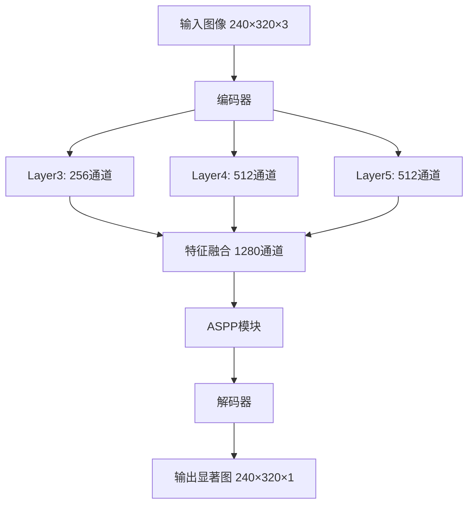
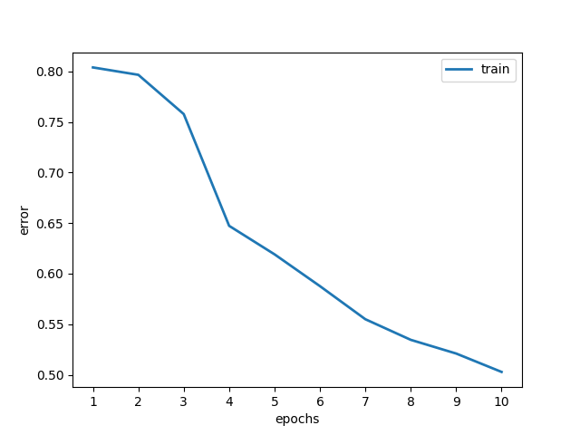
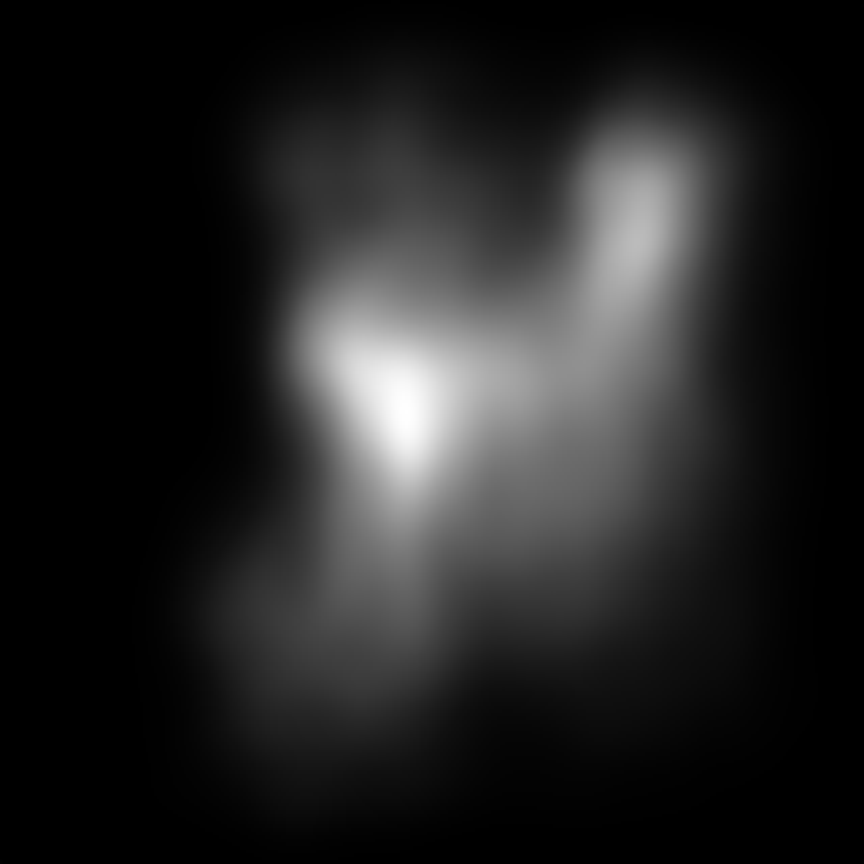

# 视觉显著性预测：上下文编码-解码网络的PyTorch重构

[](https://www.python.org/downloads/)
[](https://pytorch.org/)
[](LICENSE)

> 本项目是深圳大学脑与认知科学实验三的课程作业，将经典的视觉显著性预测论文从TensorFlow重构为PyTorch框架。

## 📖 项目简介

本项目重构了论文 **"Contextual Encoder-Decoder Network for Visual Saliency Prediction"** 的实现，将原始的TensorFlow代码完全转换为PyTorch框架。该论文提出了一种基于编码器-解码器架构的深度学习方法，用于预测图像中的视觉显著性区域。

### 📚 相关链接

- **论文原文**: [Contextual Encoder-Decoder Network for Visual Saliency Prediction](https://arxiv.org/abs/1902.06634)
- **原始代码**: [GitHub Repository](https://github.com/alexanderkroner/saliency)

### 🎯 项目动机

由于原始代码使用的TensorFlow版本过旧，环境配置困难，本项目：
- 将所有代码重构为PyTorch框架
- 简化了部署和运行流程
- 保持了原始论文的核心算法思想
- 为后续学习者提供了更易理解的代码实现

## 🚀 快速开始

### 环境要求

- **Python**: 3.8+
- **操作系统**: Windows/Linux/macOS
- **GPU**: 可选(支持CUDA加速)

### 安装依赖

```bash
# 克隆项目
git clone git@github.com:Metecade/Rebuilt-Contextual-Encoder-Decoder-Network-for-Visual-Saliency-Prediction.git
cd your-repo-name

# 安装依赖包
pip install -r requirements.txt
```

### 配置设置

编辑 `config.py` 文件来配置运行参数：

```python
PARAMS = {
    "n_epochs": 10,          # 训练轮数
    "batch_size": 1,         # 批次大小
    "learning_rate": 1e-5,   # 学习率
    "device": "cuda"         # 设备选择: "cuda" 或 "cpu"
}
```

### 数据集准备

项目使用SALICON数据集，支持自动下载：

```bash
# 数据集将自动下载到 data/salicon/ 目录下
# 包含以下结构：
# data/
# ├── salicon/
# │   └── stimulisalicon/
# │       ├── stimuli/     # 原始图像
# │       ├── saliency/    # 显著性标注
# │       └── fixations/   # 视点固着数据
```

## 🔧 使用说明

### 训练模型

```bash
python main.py train
```

### 测试模型

1. 将测试图像放置在 `data/sence/origin/test/` 目录下
2. 运行测试命令：

```bash
python main.py test
```

3. 结果将保存在 `data/sence/saliency/test/` 目录下

### 模型架构



## 📊 实验结果

### 训练曲线

<div align="center">

<p><em>图1: 训练过程中的损失变化曲线</em></p>
</div>

### 预测效果展示

<table>
<tr>
<th>原始图像</th>
<th>预测显著图</th>
</tr>
<tr>
<td></td>
<td></td>
</tr>
<tr>
<td></td>
<td></td>
</tr>
<tr>
<td></td>
<td></td>
</tr>
</table>

## 🔧 主要改动与技术细节

### 框架迁移

- **从TensorFlow到PyTorch**: 完全重构网络架构定义
- **数据格式转换**: 从`channels_last`转换为`channels_first`
- **层操作适配**: 调整池化、卷积等操作参数

### 模型结构优化

#### 编码器改动
- 移除了conv4和conv5层的池化操作
- 确保feature map尺寸一致，便于特征融合
- 修正了ASPP模块的输入通道数匹配

#### 数据集简化
- 专注于SALICON数据集
- 简化了多数据集支持逻辑
- 优化了数据加载和预处理流程

### 损失函数
```python
class KLDivLossWrapper(nn.Module):
    """KL散度损失函数，用于衡量预测显著图与真实显著图的分布差异"""
    def forward(self, y_true, y_pred):
        # 归一化为概率分布
        # 计算KL散度
        return kl_divergence_loss
```

## 📁 项目结构

```
├── config.py              # 配置文件
├── main.py                # 主程序入口
├── model.py               # MSINET模型定义
├── data.py                # 数据集加载器
├── loss.py                # 损失函数定义
├── utils.py               # 工具函数
├── requirements.txt       # 依赖包列表
├── README.md             # 项目说明
├── data/                 # 数据目录
│   ├── salicon/         # SALICON数据集
│   └── sence/           # 测试数据
└── results/             # 训练结果
    └── history/         # 训练历史
```

## ⚠️ 已知限制

1. **验证集缺失**: 当前版本为简化实现，未包含验证集评估
2. **模型保存策略**: 仅保存最终轮次模型，建议增加最佳模型保存机制
3. **评估指标单一**: 目前仅使用KL散度损失，可考虑增加其他评估指标

## 🔮 后续改进方向

其实我大部分保留了一些源代码的逻辑，包括他的一些输出样式和日志样式，有些地方确实放在现在来说太过于简陋了，但因为本人实在懒，不想全部都重构，就这样吧

先讲讲数据集的改动
原来的代码是使用了很多种的数据集，我在这里就保留了salicon 数据集，单纯是为了方便

然后是模型的改动
主要是在encoder层我移除了两层的池化层，主要是为了让concat的部分保持和原尺寸相同，然后还有一些其他的细节跟tensorflow处理不太一样，主要是pytorch是channel_first
的框架，而tensorflow是channel_last的框架，所以很多操作不能一行一行对比，我追求整体维度保持一致就ok了

最后是训练的改动
其实也不叫改动吧，我干脆讲讲我觉得这一块的欠缺，因为这篇论文距离现在也有好几年了，可能很多细节都过时了，正常来说，训练的时候最好有一个训练集和与之同分布的验证
集，该项目偷懒把验证集删了，然后是根据这个验证集的loss去做学习率的调度甚至是早停，这样就可以不用太依赖一开始设置的学习率和训练轮数了，还有一些想补充的就是信息
输出的太少了，模型文件只保存了最终一轮训练的模型，其实最好每隔几轮保存一次，并且评估最佳的，还有可以多输出除了loss之外的一些信息，这样评判标准才更多元，由于我
不是做这一方面，我不太懂应该要什么信息，这点也留给后面的人继续补充完善了

## 🤝 贡献指南

欢迎提交Issue和Pull Request来改进本项目！

## 📄 许可证

本项目采用MIT许可证 - 查看 [LICENSE](LICENSE) 文件了解详情。

## 🙏 致谢

- 感谢原论文作者的优秀工作
- 感谢深圳大学脑与认知科学课程的指导
- 感谢PyTorch和相关开源社区的支持

---

<div align="center">
<b>如果这个项目对你有帮助，请给个⭐️支持一下！</b>
</div>